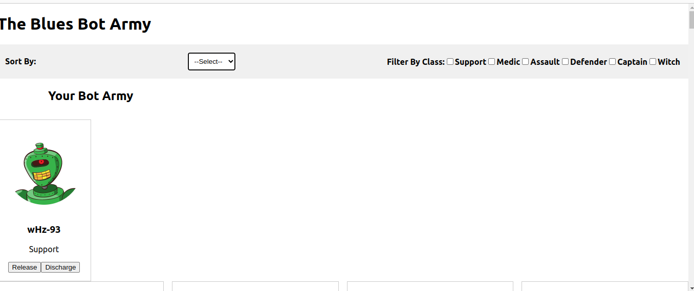
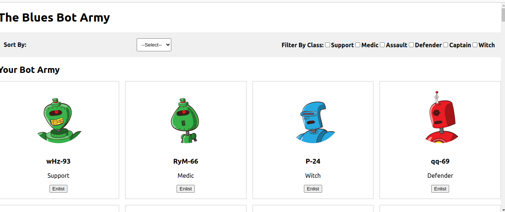
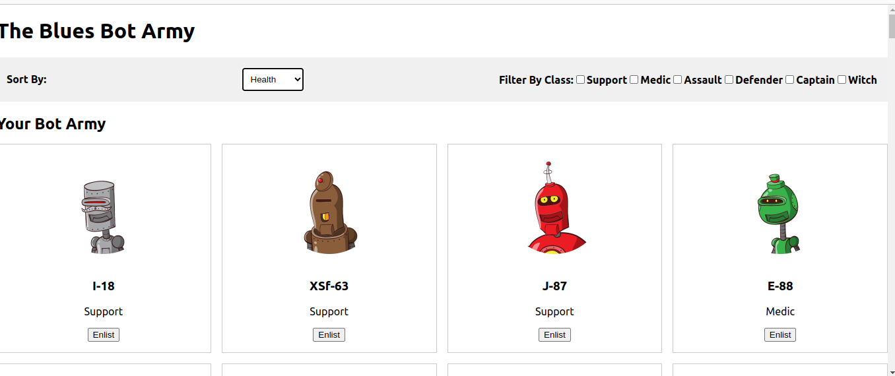
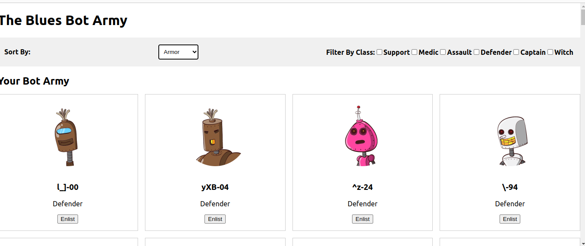

## Code challenge  Two
## Author- Collins Kipkorir
## Bot Battlr App
This is our React web app that allows users to browse through a list of robots, view a robot's details, and enlist bots into their army
## Introduction
Bot Battlr is a mini web app built with React that practices components, props, state, events, and data fetching in React. It fetches data from a local server running a JSON DB server to populate the list of available bots.
## Requirements
To run this project, you will need:

Node.js and npm installed on your machine
Local server running JSON DB server

To run this project, you will need:

Node.js and npm installed on your machine
Local server running JSON DB server
## SCREENSHOTS 

## Support and contact details 
To make a contribution to the code used or any suggestions you can click on the contact link and email me your suggestions.
    • Email: kipkorirc583@gmail.com
## License
 Copyright (c) 2023 Collins Kipkorir.

Permission is hereby granted, free of charge, to any person obtaining a copy of this software and associated documentation files , to deal in the Software without restriction, including without limitation the rights to use, copy, modify, merge, publish, distribute, sublicense, and/or sell copies of the Software, and to permit persons to whom the Software is furnished to do so, subject to the following conditions:
The above copyright notice and this permission notice shall be included in all copies or substantial portions of the Software.
THE SOFTWARE IS PROVIDED "AS IS", WITHOUT WARRANTY OF ANY KIND, EXPRESS OR IMPLIED, INCLUDING BUT NOT LIMITED TO THE WARRANTIES OF MERCHANTABILITY, FITNESS FOR A PARTICULAR PURPOSE AND NONINFRINGEMENT. IN NO EVENT SHALL THE AUTHORS OR COPYRIGHT HOLDERS BE LIABLE FOR ANY CLAIM, DAMAGES OR OTHER LIABILITY, WHETHER IN AN ACTION OF CONTRACT, TORT OR OTHERWISE, ARISING FROM, OUT OF OR IN CONNECTION WITH THE SOFTWARE OR THE USE OR OTHER DEALINGS IN THE SOFTWARE.
# challenge2boltrapp
